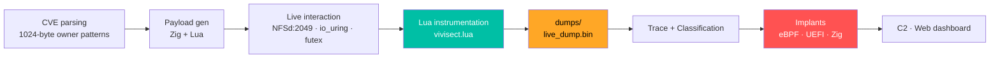

<div align="center" style="background:#0B1220; padding:28px; border-radius:16px; border:1px solid #1E3A5F">

# 🔬 VIVISECT v2.0
**Zero-budget Linux kernel research & runtime analysis platform**

<span style="color:#7DD3FC">WSL2 · Docker Desktop · Lua · Zig · eBPF · UEFI</span> · <span style="color:#00E676">Built for $0</span>

[](LICENSE)
[](https://github.com/Chikimonki/vivisect-v2/stargazers)
[](https://github.com/Chikimonki/vivisect-v2/forks)
[](https://ziglang.org)
[](https://luajit.org)
[](ebpf_rootkit/)

<br>

[](https://youtu.be/hUZ9JTGYeQo "Click to play — Vivisect runtime demo")
<br>
<span style="color:#B0BEC5">▶ Click thumbnail to play — runtime kernel analysis via Lua</span>
<br>
<span style="color:#B0BEC5">More demos: </span>
[](https://youtu.be/bFVrP7GcWYM)
[](https://youtu.be/XfMyYXfSPfA)
[](https://www.youtube.com/@Peter-i8b9b)

</div>

<br>

<details>
<summary><b>📑 Table of Contents</b></summary>

- [Core Strength](#-core-strength)
- [Architecture](#-architecture)
- [Quick Start](#-docker-quick-start)
- [Lessons Learned](#-lessons-learned--vivisect-v20)
- [Tech Stack](#-tech-stack)
</details>

---

## 🎯 Core Strength — <span style="color:#00E676">Lua runtime analysis</span>

<div style="background:#1A2332; padding:16px; border-radius:8px; border-left:4px solid #00E676">

**The Lua runtime layer is the most developed capability** — `vivisect.lua` + `run_all_validators.lua` + `memfd_exec.lua` + live `dumps/` + tracing.

<span style="color:#B0BEC5">*Real observation of kernel behavior at runtime, rather than static guessing.*</span>

</div>

> [!TIP]
> **Fresh Forensics capture:** `./forensics_capture.sh` → `forensics_report_YYYYMMDD_HHMMSS/` with hashes, SBOM, and validator logs — same 1-file as Gullwing/Kestrel.

---

## 🏗 Architecture



**Directory Highlights:**

| Path | Purpose | Colour |
|------|---------|--------|
| `vivisect.lua` + `run_all_validators.lua` | Validation suite + dynamic tracing | <span style="color:#00BFA5">Lua</span> |
| `dumps/` | Live captures, OEP dumping, unpacking | <span style="color:#FFA726">Dumps</span> |
| `ebpf_rootkit/` | eBPF stealth implants | <span style="color:#FF5252">eBPF</span> |
| `chapter2_implant.zig` + `uefi_shell.c` | Zig/UEFI implants | <span style="color:#F7A41D">Zig</span> |
| `neural/` `web/` `c2/` | Analysis + infra | <span style="color:#AB47BC">Neural</span> |
| `Dockerfile` + `deploy.sh` | Reproducible env | <span style="color:#0288D1">Docker</span> |

> [!NOTE]
> See `Repo_Structure.txt`, `Final_Structure.txt`, `tree.txt` for full tree — `docs/` holds `Blog_post.txt`, `The_Vision.txt` etc. (root clutter moved).

---

## 🚀 Docker Quick Start

<div align="center" style="background:#0F1B2E; padding:16px; border-radius:8px">

```bash
docker build -t vivisect:v2 .
docker run --rm -it --privileged -v $(pwd):/vivisect vivisect:v2
# Inside:
./run_all_validators.lua 2>&1 | tee validator_run.log
./forensics_capture.sh  # → forensics_report_YYYYMMDD_HHMMSS/
```

<span style="color:#B0BEC5">Privileged + volume mount gives userspace tracing even though kernel is shared with WSL</span>

</div>

> [!WARNING]
> `ksmbd` tests `module not found` is **environmental** — WSL kernel deliberately omits it. Use a vanilla QEMU VM mainline for full `tools/testing/selftests` + `LKDTM`.

---

## 📚 Lessons Learned — VIVISECT v2.0

<div align="center" style="background:#1A2332; padding:8px; border-radius:8px">

**Author:** Chikimonki — INTP systems explorer · **Date:** April 2026 · **Budget:** <span style="color:#00E676">**$0**</span>

</div>

<details>
<summary><b>✅ What Was Achieved</b></summary>

- End-to-end pipeline: CVE parsing → synthetic payload (1024-byte owner patterns) → live kernel interaction (NFSd 2049, io_uring, futex) → runtime classification.
- Strong runtime analysis via Lua + targeted dumping (`live_dump.bin`, `oep_dump.bin`, `unpacked_fast.bin`) + tracing (`trace.txt`, `real_output.txt`).
- Broad surface coverage (kernel, eBPF, UEFI, Zig, neural, web) in one coherent project.
- Docker integration — zero cost, open tools only.

</details>

<details>
<summary><b>⚠️ Hard Truths</b></summary>

> [!CAUTION]
> **“3× VULNERABLE flags” ≠ reliable exploit.** They mean the harness exercised paths and got observable kernel responses — not a bypass of all mitigations + reliable primitive. Gap remains large, requires deep experience, not LLM generation.

- `ksmbd` “module not found” = WSL `.config` — not validator logic. Lesson: `kernel .config` + `loaded modules` dominate results more than harness.

</details>

<details>
<summary><b>💡 Key Intellectual Insights</b></summary>

1. **LLMs are momentum engines** — great scaffolding across Lua/Zig/C/shell, poor substitute for tactile `run against live kernel` feedback.
2. **Runtime observation beats static guessing** — `trace.txt` + `real_output.txt` + binary dumps are the real signal.
3. **Breadth vs depth trade-off** — many valuable threads; declare a primary axis (e.g., *Runtime Kernel Analysis via Lua*) and treat implants/C2/neural as satellites.
4. **Linux = Perl-like surprises** — “more than one way to do it” — validators exposed some in controlled way.
5. **Docker + privileged + volume mounts = reproducibility** for userspace tracing.

</details>

> [!TIP]
> **Next:** Capture fresh `run_all_validators.lua` output in Docker, mine `logs/dumps` for patterns, add `tools/testing/selftests` + `LKDTM`, and move heavy kernel work to QEMU vanilla mainline.

---

## 🔧 Tech Stack

| Component | Technology | License |
|-----------|-----------|---------|
| Dynamic instrumentation | LuaJIT `vivisect.lua` | MIT |
| Implants | Zig `chapter2_implant.zig` + C `uefi_shell.c` + eBPF | MIT |
| C2 / Web | `web/` dashboard | — |
| Environment | Docker Desktop + WSL2 | — |
| Evidence | `forensics_capture.sh` → SBOM + hashlist | MIT |

<div style="background:#00BFA5; color:#000; padding:8px; border-radius:8px; text-align:center">

**Zero-budget. Zero API keys. Fully reproducible. 100% open-source scaffolding.**

</div>

---

## 🎥 Video & Channel

<div align="center">

[](https://youtu.be/hUZ9JTGYeQo)
<br>
**Vivisect runtime demo — Lua tracing + memory dumping**
<br>
[](https://www.youtube.com/@Peter-i8b9b)

</div>

---

## 📜 License

<div align="center" style="background:#1A2332; padding:12px; border-radius:8px">

**MIT** — *Permanently increased my intuition about kernel attack surfaces and the difference between research harnesses and production exploits — that alone makes the $0 investment worthwhile.*

</div>
